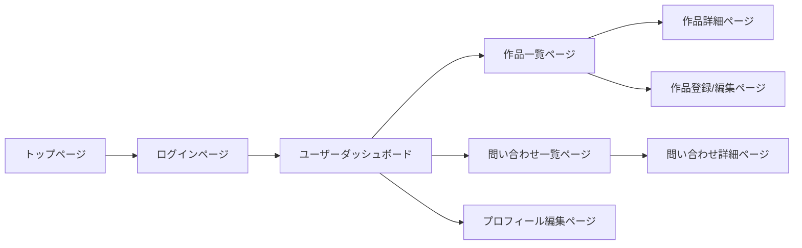
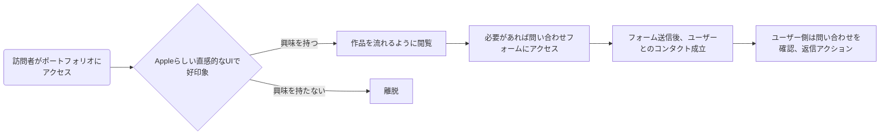
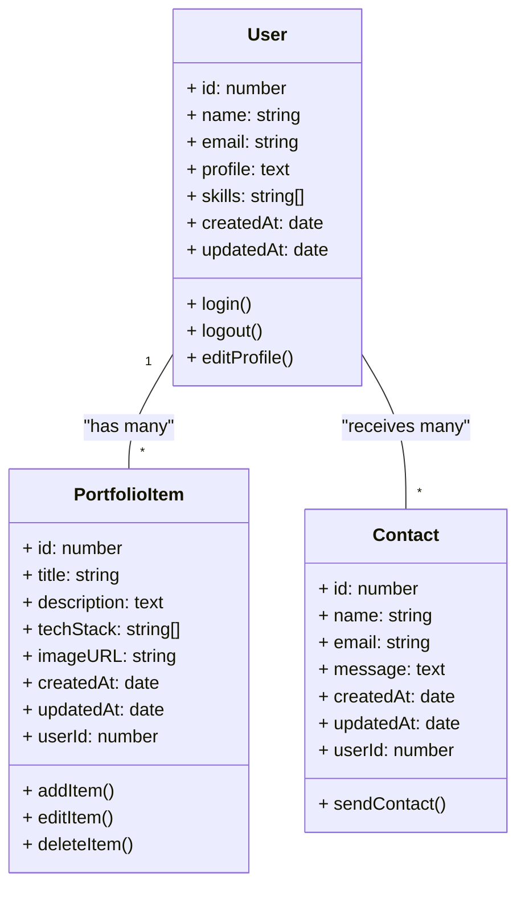
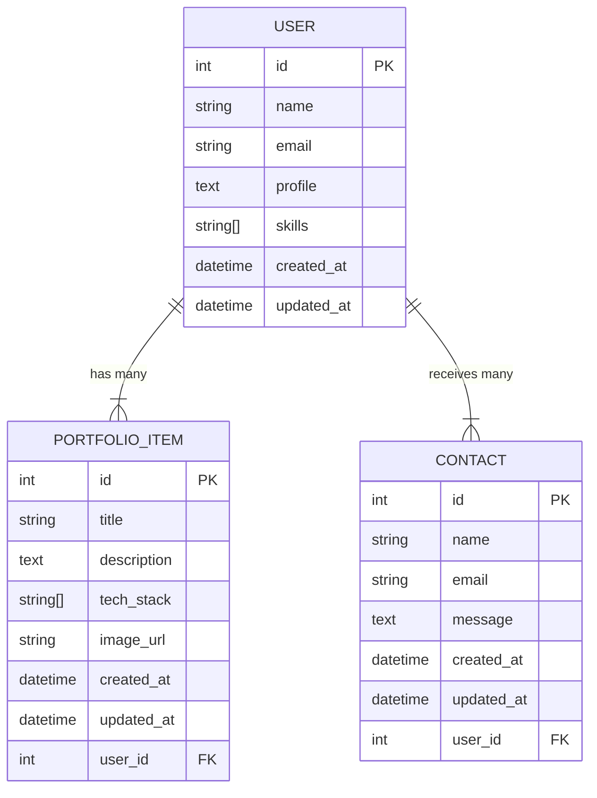

以下は、頂いた情報を反映したポートフォリオシステムの仕様書（ドラフト）です。  
マークダウン形式でAIが解読しやすい構造を意識しています。

---

# ポートフォリオ仕様書

## 1. プロダクト概要

### 1-1. ゴール / テーマ
- **「開発者としてのスキルを一元管理し、効果的にアピールするためのポートフォリオ」**  
- ユーザー（エンジニア転職希望者）が自分のスキルセット・実績をまとめ、転職活動やクライアントへの提案時に強みをわかりやすく示すことを主目的とする。

### 1-2. Jobs to be done
- 自身の開発スキル・実績を一箇所にまとめる  
- 採用担当者・クライアントが、短時間で「この人の強み」を理解できるようにする  
- ユーザーが問い合わせを受け取り、スムーズにコミュニケーションを取れるようにする  

## 2. プロダクトの目的と価値

### 2-1. 誰もが同じように感じられる価値
- **文化・言語の壁を超えた直感的な魅力**  
  - シンプルでクリーンなUI（Appleらしいデザイン）で、国・地域にかかわらず見やすいレイアウトを提供。
  - 作品やスキルをビジュアル的に把握しやすい構造。

### 2-2. 永続的な普遍の価値
- **時間が経過しても陳腐化しにくい構造**  
  - 使用技術や成果物は更新が必要だが、「個人が何を得意とするか」を示す核となる部分は変わらない。
  - ポートフォリオ自体を定期的にアップデートしつつ、メインの価値はいつでも維持できる。

## 3. 対象ユーザー
- **エンジニア転職希望者**（最もメイン）
  - Webエンジニア、アプリ開発者など幅広い開発職を想定
- 採用担当者・クライアント
- 自分の技術力を可視化・整理したいクリエイター

## 4. 機能要件

### 4-1. 必須機能
1. **問い合わせ機能**  
   - 外部の採用担当者などがユーザーへ直接連絡できるフォーム
   - ユーザーが受信した問い合わせを確認できる画面
2. **ログイン認証機能**  
   - ログインしているユーザーのみが作品（ポートフォリオ）を追加・編集・削除できる
   - パスワードリセット、ログアウト などの基本認証機能を含む

### 4-2. その他の基本機能
- **作品一覧表示**  
  - ユーザーが登録した作品を一覧で表示する。サムネイル・タイトル・簡単な説明を含む。
- **作品詳細ページ**  
  - 作品に関する詳細（使用技術、成果物の画像、URL、解説など）を表示。
- **プロフィール機能**  
  - 名前、自己紹介、スキルセットなどユーザー個人を紹介。
- **SNS/外部リンク連携**（任意）  
  - GitHubやSNS、Qiitaなど関連サービスのリンクを貼れるオプション。

## 5. 技術仕様と根拠

### 5-1. フロントエンド
- **TypeScript + React**  
  - コンポーネント指向で開発がしやすい。  
  - TypeScriptを使うことで型チェックによりバグを減らし、大規模化しやすい構造を確立。  
  - SPAを実現し、高速なページ遷移を提供。

### 5-2. バックエンド
- **TypeScript + Express**  
  - Node.jsベースで、フロントと同じTypeScript言語を共有できる。  
  - Expressは軽量かつ柔軟で、ログイン認証などを独自に実装しやすい。

### 5-3. データベース
- **リレーショナルDB（MySQL/PostgreSQLなど）を想定**  
  - ユーザーや作品、問い合わせをテーブルで管理しやすい構造。
  - ORMとしてはPrismaやTypeORMなどTypeScript対応のものを利用する可能性。

### 5-4. ホスティング / 運用環境
- **Vercel**  
  - Reactアプリのデプロイに強い。  
  - バックエンド（サーバーレスFunctionsなど）も用意できるが、必要に応じてRailwayやRenderなど併用の可能性あり。

### 5-5. その他ライブラリ / ツール
- UIフレームワーク: （例）Chakra UI / Material UI / Tailwind CSS など  
- テストフレームワーク: Jest / Testing Library (React Testing Library)  
- 認証管理: JWTを使ったセッション管理を想定（express-jwt等）

## 6. ディレクトリ構成

```plaintext
portfolio/
 ┣━ frontend/
 │   ┣━ src/
 │   │   ┣━ components/
 │   │   ┣━ pages/
 │   │   ┣━ hooks/
 │   │   ┗━ utils/
 │   ┣━ public/
 │   ┣━ package.json
 │   ┣━ tsconfig.json
 │   ┗━ yarn.lock (または package-lock.json)
 ┣━ backend/
 │   ┣━ src/
 │   │   ┣━ controllers/
 │   │   ┣━ middleware/
 │   │   ┣━ models/
 │   │   ┣━ routes/
 │   │   ┣━ utils/
 │   │   ┗━ index.ts
 │   ┣━ package.json
 │   ┣━ tsconfig.json
 │   ┗━ yarn.lock (または package-lock.json)
 ┣━ database/
 │   ┣━ migrations/
 │   ┗━ seeds/
 ┣━ docs/
 │   ┗━ (各種仕様書やデザインファイルなど)
 ┣━ .env (環境変数ファイル)
 ┗━ README.md
```

## 7. 表、画面遷移、フローチャート

### 7-1. 画面遷移図（Mermaid例）



- **トップページ**  
  - 未ログインユーザーには、サイトの概要や作品のサンプルのみ表示。  
  - ログイン／サインアップ導線を配置。  
- **ログインページ**  
  - ログイン後はダッシュボードや編集機能にアクセスできる。  

### 7-2. フローチャート（問い合わせ送信の例）

```mermaid
flowchart TB
    A[トップページ(作品詳細など)] --> B[問い合わせフォームへ移動]
    B --> C[フォーム入力]
    C --> D{入力内容に不備はないか}
    D -->|OK| E[送信] --> F[DBに保存]
    D -->|NG| C[再入力]
    F --> G[サンクスページ（送信完了）]
```

## 8. UXフロー（Mermaid例）



## 9. UX原則
- **シンプルさを保つこと**  
  - 作品やスキルを余計な情報なく閲覧できる
- **明確なメッセージを表示し、世界中で誰もが一瞬で理解できるようにする**  
  - 言語選択やUIアイコンで直感的に理解可能に
- **気持ちを意識してデザインをすること**  
  - スムーズなアニメーションや遷移
- **世界で使われることをいつも考えること**  
  - 多言語対応やユニバーサルデザインを検討
- **身体の制限の中で挑戦と満足感を得られること**  
  - アクセシビリティにも配慮

## 10. UI原則
- **OOUI（Object-Oriented User Interface）**  
  - 作品・問い合わせ・プロフィールといったオブジェクト単位でUIを構成
  - 各オブジェクトのプロパティやアクションを分かりやすく配置

## 11. UI設計（OOUIベース）

### 11-1. メインオブジェクトとプロパティ

1. **User（ユーザー）**
   - プロパティ:  
     - `id`: number  
     - `name`: string  
     - `email`: string  
     - `profile`: text (自己紹介)  
     - `skills`: string[] (スキル配列)  
     - `createdAt`: date  
     - `updatedAt`: date  
   - アクション:  
     - ログイン / ログアウト  
     - プロフィール編集  
     - 作品管理（作成/編集/削除）の権限を持つ  

2. **PortfolioItem（作品）**
   - プロパティ:  
     - `id`: number  
     - `title`: string  
     - `description`: text  
     - `techStack`: string[] (使用技術)  
     - `imageURL`: string (サムネイル画像など)  
     - `createdAt`: date  
     - `updatedAt`: date  
     - `userId`: number (所有ユーザー)
   - アクション:  
     - 登録 / 編集 / 削除 / 閲覧  

3. **Contact（問い合わせ）**
   - プロパティ:  
     - `id`: number  
     - `name`: string (送信者名)  
     - `email`: string (送信者の連絡先)  
     - `message`: text (メッセージ内容)  
     - `createdAt`: date  
     - `updatedAt`: date  
     - `userId`: number (受信先ユーザー)
   - アクション:  
     - 問い合わせ送信  
     - 確認 / 返信(メールなど外部連携)

### 11-2. 関連オブジェクト（Mermaid例）



## 12. データベース

### 12-1. ER図（Mermaid例）



### 12-2. サンプルデータ（CSV例）

#### `user.csv`
```
id,name,email,profile,skills,created_at,updated_at
1,John Doe,john@example.com,"Full-stack developer",["React","Node.js"],2025-03-01 10:00:00,2025-03-01 10:00:00
2,Jane Smith,jane@example.com,"Frontend engineer",["React","TypeScript"],2025-03-02 12:00:00,2025-03-02 12:00:00
```

#### `portfolio_item.csv`
```
id,title,description,tech_stack,image_url,created_at,updated_at,user_id
1,"My First Website","A simple static website",["HTML","CSS","JavaScript"],"https://example.com/img1.jpg","2025-03-01 10:10:00","2025-03-01 10:10:00",1
2,"Awesome App","Mobile application for tracking habits",["React Native","Node.js"],"https://example.com/img2.jpg","2025-03-02 09:30:00","2025-03-02 09:30:00",1
3,"Portfolio Redesign","Landing page to showcase design skills",["Figma","React"],"https://example.com/img3.jpg","2025-03-03 08:00:00","2025-03-03 08:00:00",2
```

#### `contact.csv`
```
id,name,email,message,created_at,updated_at,user_id
1,"Recruiter A","recruiterA@company.com","Interested in your React Native project","2025-03-04 09:00:00","2025-03-04 09:00:00",1
2,"Recruiter B","recruiterB@agency.org","Looking for a frontend engineer","2025-03-05 10:00:00","2025-03-05 10:00:00",2
```